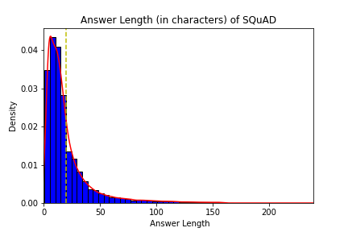
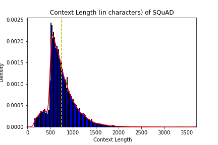
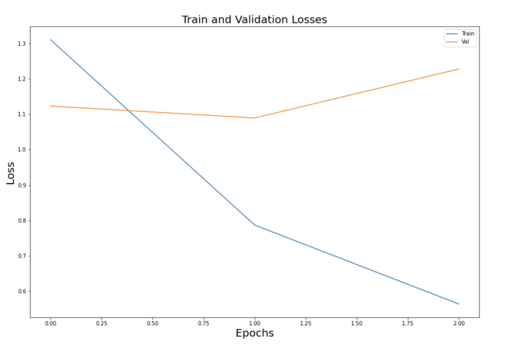
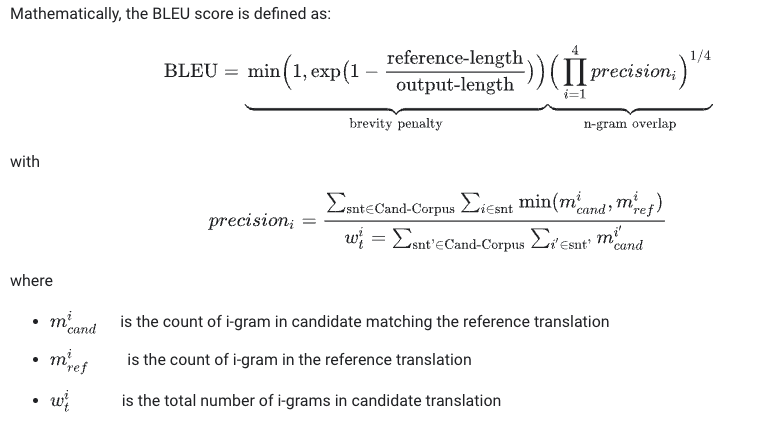

<!-- 


**[Biscuit](http://sblisesivdin.github.io/biscuit)** is a single-page responsive Jekyll theme. This is the most simple and still-good-looking Jekyll theme that you can find.  -->


<h1 style="text-align: center;"><Strong>Reliable Answer Deduction (RAD)</Strong></h1>
<h2 style="text-align: center; margin-top:-2.5rem;">Know When To And When Not To</h2>

<h3 style="text-align: center;">CS7641 | Semester Project | Group 33</h3>

[](https://github.com/user/repository/subscription)

## Introduction

There is a plethora of textual information out there and it has become increasingly difficult to draw insights from the data and find the relevant answers to our questions. Question-answering systems like Machine Reading Comprehension (MRC) systems are effective in retrieving useful information, wherein the model retrieves the answer from given comprehensions instead of the web. A lot of attention has been given to MRC tasks lately. Although existing models achieve reasonably good results, they may still produce unreliable answers when the questions are unanswerable and are computationally heavy. Thus, our aim here is to experiment and present a model which is more reliable.


## Problem Definition

Our aim here is to leverage the power of Machine Learning and Natural Language Processing to create a model that deducts the answer when given a passage and also identifies if a question is unanswerable. We plan to develop an ensemble model which successfully accomplishes the task and gives reliable answers to the questions asked from the comprehension. Our proposed approach will be to innovate different modules in our architecture by taking inspiration from state of the art architectures. 


## Dataset
We are going to use Stanford Question Answering Dataset 2.0 ([SQuAD2.0](https://rajpurkar.github.io/SQuAD-explorer/))  combines the 100,000 questions in SQuAD1.1 with over 50,000 unanswerable questions. It was written adversarially by crowdworkers such that unanswerable questions look similar to answerable ones. To do well on SQuAD2.0, systems should answer questions when possible and also determine when no answer is supported by the paragraph and abstain from answering. 


A sample of raw dataset has been shown below showcasing questions with their actual or plausible answers. The *“is_impossible”* flag is provided to distinguish between answerable and unanswerable questions and the features for the question vary accordingly. 

## Sample Dataset Q&A format


 
## Sample Model Output ([Source](https://rajpurkar.github.io/SQuAD-explorer/explore/v2.0/dev/Normans.html?model=nlnet%20(single%20model)%20(Microsoft%20Research%20Asia)&version=v2.0)):


## Algorithms/Methods:
We would be using a Deep Learning architecture for our Machine Reading Comprehension (MRC) task. It would involve the following sections/tasks -
Embedding module, Feature extraction, Context question interaction, Verification module and answer prediction. 
We would use contextual embeddings from BERT and then experiment with the feature extraction techniques in combination with the attentive context question interaction methods. Span Extractor has been proven to work well as an answer predictor in MRC tasks in existing literature<sup>[7]</sup>  but we would be experimenting with other methods as well. We would also be exploring unsupervised models which learn via self-supervision.


## Potential results and Discussion
We hope to achieve competent scores on the popularly used metrics for this task which are F1 score and EM score. These scores are already used in the SQuaD<sup>[5]</sup> to compare various models on the dataset. Additionally, if we are able to develop a competent model, we would also like to focus on keeping the model light in terms of the model size, so that it could be deployed in places where computational resources are limited.

<!-- ## Data Exploration




<!--  -->

<!--  -->


## Gantt Chart


# Midterm

### Dataset Preprocessing & Exploration

When it comes to SQUAD 2.0 dataset, we found it to be mostly reliable and clean. However, we did do some basic cleaning exercise of removing the additional white spaces, conversion to lower case, stripping of unknown ASCII characters and tokenization as per the model requirement. Datapoints which had unreasonably small question length have been removed from both Training and Testing datasets. In order to convert the words in the passage to their root form to be in sync with the answers, we have used Lemmatization technique. Feature engineering was also done to find the end character of the answers given we have been provided with the start character.

The training dataset of SQUAD 2.0 is unbalanced with two thirds of questions being "Answerable" and the testing dataset is highly balanced with the "Answerable" questions comprising 49.9% of the data as can be seen below.

<table>
  <tr>
    <td></td>
    <td></td>
  </tr>
 </table>

We also did an analysis to understand the distribution of questions per passage across the train and test datasets and concluded that test dataset has an average of 10 questions being asked per context passage and the distributions are shown below:

<table>
  <tr>
    <td></td>
    <td></td>
  </tr>
 </table>

Next, we looked at the lengths of the context, questions and answers to understand the dataset better and identify any outliers

<table>
  <tr>
    <td></td>
    <td></td>
   <td></td>
  </tr>
 </table>
 
Lastly, we looked at the dominant words in the contexts and the questions by creating a wordcloud after removing the stopwords
 
 <table>
  <tr align="middle">
    <td>Wordcloud for given Contexts</td>
    <td>Wordcloud for given Questions</td>
  </tr>
  <tr>
    <td></td>
    <td></td>
  </tr>
 </table>

## UnSupervised Learning

### Generative Pre-trained Transformer 3

<p float="left" align="middle">
 
</p>

GPT-3 is an autoregressive language model which shows strong few shot learning capability on natural language tasks. It has a transformer architecture which is trained using the generative pre-training method. It has the capability to produce human-like answers. Since it can perform new tasks that it hasn’t been trained on, it can be used as an unsupervised method. Hence, we use GPT-3 with engine ‘text-davinci-002’ for our question answering task without providing the answers to it, more specifically, we ask GPT-3 to perform the following tasks to generate an answer. For the first task, we provide the model with only the question and task prompt `Give an answer of length less than x words.`. For the second task, we provide the model with the question, the context paragraph and the task prompt - `Based on the context below give an answer to the question below. The answer should have less than x words`. For both the tasks we provide GPT-3 with an answer length based on the dataset answer length to avoid undesirably long answers. On each answer we obtain the similarity by comparing the embeddings of GPT answer and the SQuAD dataset with the 'text-similarity-davinci-001' engine as shown in the image shown below. Finally, we compare the answers generated by the model with the answer provided in the dataset by computing L2 similarity score.

<p float="left" align="middle">
 
</p>


### GPT-3 Output Analysis:

Under the unsupervised method using GPT-3 we analyzed the statistics on the answers. We compare GPT-3’s performance with the SQuAD dataset.  We use a subset of 500 datapoints and use this to derive insights.

As discussed we assign GPT-3 the task of giving answers to our questions. We do it in branches. Firstly, we don’t give GPT-3 the context to our question. We allow it to use it’s vast knowledge gained by being trained on millions of articles to answer a question. Based on the word length of answers in SQuAD we try asking GPT-3 to limit it’s answer length to avoid unnecessary information leading to score diversion.

In the plot below, we see that our dataset gives much more concise answers compared to the GPT model. Also we see roughly the GPT answers are much more verbose. This comes from the fact that GPT has knowledge of things which are not necessarily in the context used in the SQuAD dataset. GPT roughly gives an answer of character length of 41 on average. 

 <p float="left" align="middle">
 
</p>


Now checking the similarity between answers from GPT-3 and SQuAD dataset we get a similarity plot as shown below.

We see that the graph is not skewed towards score of 1 meaning the fraction where GPT-3 results overlap with SQuAD considerably is less. This is probably due to the additional information given by GPT3. The average similarity score or accuracy is 81.9%.
```
Example (No Context): 
* Question: When did Beyonce start becoming popular?
* GPT-3 Answer: Beyonce started becoming popular in the early 2000s.
* SQuAD Answer: In the late 1990s.
```

<p float="left" align="middle">
 
</p>


Now when we give GPT the context along with the question we see interesting insights being derived. Firstly, we that the answer length now starts matching the answers from SQuAD dataset. And there is no divergence in the answer length between SQuAD and GPT-3. This is much more closer to SQuAD dataset. The average answer length is 28.0.

<p float="left" align="middle">
 
</p>

As expected we also see a huge improvement in the similarity scores between GPT-3 answers and SQuAD answers. We see that many questions are now answered with 100% accuracy. The average accuracy is 86.4%. Thus providing context makes answers both concise and precise to SQuAD.

```
Example (With Context): 
* Question: When did Beyonce start becoming popular?
* GPT-3 Answer: In late 1990s.
* SQuAD Answer: In the late 1990s.
```


<p float="left" align="middle">
 
</p>


We also verify the plausible answers to which SQuAD thinks it’s improbable to answer the question. From the graph below we see that when we give the context - the questions which are termed unanswerable and have a plausible answer are similar to GPT-3 predictions. On the other hand there is divergence when we don’t give the context. This is because without context GPT-3 takes in all the knowledge and answers all questions. 

<p float="left" align="middle">
 
</p>
 

Scores for the current fine tuned model:
<table align="middle">
  <tr>
    <td>Measure</td>
    <td>Context</td>
    <td>Without Context</td>
  </tr>
  <tr>
    <td>Similarity Avg Score (%)</td>
    <td>86.4</td>
    <td>81.9</td>
  </tr>
  <tr>
    <td>Average Answer Length</td>
    <td>28.0</td>
    <td>41.0</td>
  </tr>
  <tr>
    <td>Max Answer Length</td>
    <td>251</td>
    <td>306</td>
  </tr>
  <tr>
    <td>Plausible Answer Similarity (%)</td>
    <td>82.4</td>
    <td>82.0</td>
  </tr>
 </table>
 
Now we analyze the answers generated by GPT across the various commonly asked questions like "When", "What", "How", and "Why" against the actual answers provided by the SQuAD 2.0 dataset. Throughout majority of questions, we can see that answers given by GPT without any context are higher when compared to the other two categories. GPT with context is also highly in sync with true values for short answers except for the questions containing "Why". These discrepancies can be attributed to low datapoints as only 10 questions were found to contain "Why" within our sample. Questions with "What" are the most reliable as they span almost 59% of the sample with 295 datapoints

 <table>
  <tr>
    <td></td>
    <td></td>
  </tr>
  <tr>
    <td></td>
    <td></td>
  </tr>
 </table>
 
 


## Supervised Learning

### Bi-Directional Attention Flow (BiDAF) model: 

#### Introduction
	
Bi-Directional Attention Flow (BiDAF) is a multistage network which uses bi directional attention flow mechanism to model a query-aware context representation. We use this architecture for our question answering task due it’s effective attention computation at every time step which reduces information loss. Additionally, since the attention computed at every time step is a function of the context paragraph and the question at the current time step, it allows the model to have a memory-less attention mechanism which enables the model to learn the interaction between the given context and the question.

The BiDAF architecture details can be found [here](https://arxiv.org/pdf/1611.01603.pdf)<sup>[8]</sup>:

 <p float="left" align="middle">
 
</p>
 
#### Feature Extraction

From the dataset, we consider all context and question pairs as different data samples. In order to extract the features for each sample we perform the following additional steps. First, we tokenize the context and retrieve span (start and end indices) of the word token in the context. Similarly, for all answers given we calculate the end character index and answer spans in the context tokens. For unanswerable questions, the start and end indices are set as -1. Finally, to feed into the model we have the following features: embedding indices of context tokens, embedding indices of all characters in the context tokens, embedding indices of question tokens, embedding indices of all characters in the question tokens, answers start spans’ and answer end spans’. We use pretrained GloVe embeddings to get the corresponding word vectors.
 
#### Results

Below are the results and training details for our preliminary fine tuning:
<table>
  <tr align="middle">
    <td>Train/NLL</td>
    <td>Dev/NLL</td>
  </tr>
  <tr>
    <td></td>
    <td></td>
  </tr>
 </table>
 
Scores for the current fine tuned model:
<table align="middle">
  <tr>
    <td>F1 Score</td>
    <td>54.91</td>
  </tr>
  <tr>
    <td>EM Score</td>
    <td>51.79</td>
  </tr>
  <tr>
    <td>AvNA Score</td>
    <td>62.04</td>
  </tr>
 </table>
 
#### Analysis of fine tuning:
The training is highly sensitive to the following parameters:
* Batch size
* Learning rate 
* Max answer length

The plots above are for batch size = 64, learning rate =  0.5 and max answer length = 15. 

The calculations above are optimally computed using a few experiments until now but these are subject to change once we experiment with the parameters exhaustively. The model is still low relative to its potential on F1 and EM scores of BiDAF models tuned on this dataset. An interesting point to note is that the model has performed relatively better on AvNA metric which basically measures the classification accuracy of the model when only considering its answer (any span predicted) vs. no-answer predictions. This is due to the architecture of BiDAF which allows it to compare the predicted answer versus the no answer hypothesis effectively. One major challenge that we have faced is the limited availability of computing resources. Training process took a lot of time computationally and made effective testing with more combinations of hyperparameter tuning completely infeasible. We have tried reducing the training dataset points to deal with the issue, but it leads to higher loss on dev validation sets as well. We are yet to reach an estimate for the optimal point of this tradeoff.


 

## Further Steps
We would further tune the BiDAF model experimenting with more combinations of hyperparameters. Going ahead we would be experimenting with relevant BERT based models for the QA task and performing comparative studies for the fine tuned models.

## Progress Status
<p float="left" align="middle">
 
</p>
 
 
# Progress Report after Midterm

## Supervised Learning

### Fine-Tuning Bert:

#### Introduction

Bidirectional Encoder Representations from Transformers (BERT) employs masked language models to create pre-trained deep bidirectional representations. Thus, reducing the need for many heavily-engineered task-specific architectures. BERT achieves state-of-the-art performance on sentence-level and token-level tasks, outperforming other task specific architectures. We therefore choose BERT for our question answering task and fine tune it on Squad V2.0.

<p float="left" align="middle">
 
</p>

We built a BERT-based model which returns an answer for a given question and a passage, which will also include the answer of the question. We start with the pretrained BERT-base model "bert-base-uncased" and fine-tuned it multiple times by varying parameters such as number of epochs, learning rate and batch size for the Data Loader.


#### Feature Extraction

First of all, we read both training and validation datasets and proceed with the following pre-processing steps:
* Filter out all contexts, questions and answers from both the datasets.
* Next, we compute the start and ending index for all the answes in each dataset. For unanswerable questions, the start and end indices are set as -1.
* Tokenize all the contexts and questions filtered out in the step 1 and then convert the start-end positions from previous step to tokens' start-end positions.
* Then put all the data to DataLoader, so as to split them in "pieces" of provided batch size.
 
#### Analysis of fine tuning:
The training on the Squad2.0 dataset is highly sensitive to the following parameters:
* Number of Epochs: Concerning the *number_of_epochs*, we began with 2 and realized that overfitting happened from the very first epoch. When we tried to train the model for more number of epochs, overfitting happened after the first epoch itself and the gap between the training and validation loss was getting bigger and bigger with each epoch.

* Batch size: For *batch_size*, it was impossible to train the model with bigger batch size as we were running out of computation resources. Initially, Google Colab free version crashed with a batch size of 16. Therefore, we moved to Google Colab Pro Premium High-ram GPUs for training with a higher batch size and observed better results. 

* Learning rate: For *learning_rate*, we tried 5e-5 initially but we observed overfitting, but increasing the batch_size improved the performance as clearly visible in the graphs shown (overfitting started from later epoch). Also, by using the LR Scheduler and much smaller learning_rate, we got better results as depicted in the final graph.


We fine tuned our model with couple of parameters:

**Case1:** Batch_size = 8, Learning_rate = 5e-5 and Number of epochs = 3
<p float="left" align="middle">
 
</p>

**Case2:** Batch_size = 16, Learning_rate = 5e-5 and Number of epochs = 3
<p float="left" align="middle">
 
</p>

**Case3:** Batch_size = 16, Learning_rate = 1e-6 and Number of epochs = 4 and Using LR Sceduler for Learning rate decay
<p float="left" align="middle">
 
</p>
 
#### Results

As clearly visible from the above shown graphs, we got the best results with 1e-6 learning_rate, 4 epochs, 16 batch_size and LR scheduler. The scores for the model can be found below:
<table align="middle">
  <tr>
    <td>Various Models</td>
    <td>F1 Score</td>
    <td>EM Score</td>
  </tr>
  <tr>
    <td>Batch_size=8, Learning_rate=5e-5 and Number of epochs=3</td>
    <td>51.15</td>
    <td>44.48</td>
  </tr>
  <tr>
    <td>Batch_size=16, Learning_rate=5e-5 and Number of epochs=3</td>
    <td>55.59</td>
    <td>53.67</td>
  </tr>
  <tr>
    <td>Batch_size=16, Learning_rate=1e-6 and Number of epochs=4 using LR Sceduler</td>
    <td>75.89</td>
    <td>71.91</td>
  </tr>
 </table>
 
### Fine-Tuning BiDAF: 

### ALBERT: 
A Lite BERT (ALBERT) for self - supervised learning of language representations is an extension of the BERT model with modifications to make it a lighter model. It employs two parameter reduction techniques which help lower the memory consumption as well as decrease the training time required. It uses a transformer encoder with GELU nonlinearities like BERT. Three significant design choices that are used in ALBERT are Factorized embedding parameterization, Cross-layer parameter sharing and Inter-sentence coherence loss. 
- **Factorized embedding parameterization** - Embedding parameters are decomposed into two smaller matrices. Instead of projecting the one-hot vectors directly into the hidden space of size H, it is projected into a lower dimensional embedding space, and then projected to the hidden space. 
- **Cross-layer parameter sharing** - the model shares all parameters across layers
- **Inter-sentence coherence loss** - ALBERT uses a sentence-order prediction (SOP) loss which focuses on modeling inter-sentence coherence. Thus, avoids topic prediction. The SOP loss uses two consecutive segments from the same document.  For positive examples, these segments are taken in the same order and for negative examples their order is swapped. This enables the model to learn fine-grained differences.

These changes enable ALBERT models to have significantly smaller parameter size as compared to the BERT models.

<p float="left" align="middle">
 
</p>

<p float="left" align="middle">
 
</p>


## Unsupervised Learning

### GPT-3 Further Analysis - BLEU Analysis:

BLEU - BiLingual Evaluation Understudy is a score widely used in NLP to evaluate the similarity between the sentence and the target sentences. It compares the n-gram of the predicted sentence with the n-gram of the target sentence to count the number of matches. The match check is independent of the positions where they occur and more the number of matches, the better the machine translation. A score of 1 indicates a perfect match while a score of 0 indicates a complete mismatch. The calculation of BLEU comprises of 2 main parts:
- **N-Gram Overlap:** 
	N-Gram basically refers to a set of ‘n’ consecutive words in a sentence. As an example, if for the sentence “I really love football”, we find 1-Gram, then we get ‘I’, ’really’, ‘love’, ‘football’, for 3-Gram we get ‘I really love’, ‘really love football’

	N-Gram Overlap counts the number of times the 1-Grams, 2-Grams, 3-Grams of predicted sentence match their n-gram counterpart in the target sentence acting as a metric for precision. The n is fixed based on the maximal n-gram count occurring in the target sentence

- **Brevity Penalty:** 
	As the name suggests, this metric penalizes the generated translations that are too short compared to the closest target length with an exponential decay compensating for the missing recall term in the BLEU calculation 

The details of the calculation can be seen in the image below:
<p float="left" align="middle">
 
</p>

**Why BLEU is bad? **

The BLEU metric performs badly when used to evaluate individual sentences. For example, both example sentences get very low BLEU scores even though they capture most of the meaning. Because n-gram statistics for individual sentences are less meaningful, BLEU is by design a corpus-based metric; that is, statistics are accumulated over an entire corpus when computing the score. Note that the BLEU metric defined above cannot be factorized for individual sentences.

#### Analysis of BLEU Metric:

On evaluation for BLEU scores based on n-grams, we see that the trend is similar both across GPT scores with context and without context however there is huge difference in average similarity value. As expected we see that the 1-Gram variant of BLEU performs the best in both cases. When given context to answer a question the average BLEU (1-G) score is around 0.45 while for no context answering the average BLEU (1-G) score is around 0.109. We see that these average scores are much smaller compared to the similarity metric that we originally use with ‘text-similarity-davinci-001’. Because BLEU works on corpus it is not well suited to our case and hence using L2 Score along with ‘text-similarity-davinci-001’ is more preferred to our use case. 

<table>
  <tr>
    <td></td>
    <td></td>
  </tr>
 </table>
 
 <table>
  <tr>
    <td>n-Gram</td>
    <td>Average Scores with context</td>
    <td>Average Scores w/o context</td>
  </tr>
  <tr>
    <td>1</td>
    <td>0.459238</td>
    <td>0.109498</td>
  </tr>
  <tr>
    <td>2</td>
    <td>0.221127</td>
    <td>0.047953</td>
  </tr>
  <tr>
    <td>3</td>
    <td>0.093257</td>
    <td>0.026187</td>
  </tr>
  <tr>
    <td>4</td>
    <td>0.037704</td>
    <td>0.015227</td>
  </tr>
 </table>
 
 
**Challenge** One problem that we encounter while using GPT is the length of answer it outputs. This can also be seen in our example prompt towards the end of the page. We see that GPT inherently answers comprehensively to each question. However, the dataset, SQuAD has answers which are lesser in length. Thus to make a fair comparison we need to limit the answer length that the GPT outputs to a given question. It’s to be noted that the long-length answers that GPT produces are accurate - it’s just that having such comprehensive answers limits our ability to compare it with SQuAD dataset.

Comparing BLUE scores with similarity scores we see that similarity gives us a better estimate. And it is more skewed towards score 1 whereas BLEU is skewed to score 0 even though the answers are accurate to a human eye and brain. This a proof of how BLEU scores are not the best metric for our dataset. We also see that when we don’t give any context the scores are strongly-skewed to 0. Without context even the similarity scores get slightly skewed which is evident from the plots.

 <table>
  <tr>
    <td></td>
    <td></td>
  </tr>
 </table>
 
The graph below shows the comparison between different N-grams where N can be 1, 2, 3, 4. We see that as the similarity performance reduces as the value of N increases. And the trend between BLEU and Da-vinci-similarity that we use remains the same. 

 <table>
  <tr>
    <td></td>
    <td></td>
  </tr>
  <tr>
    <td></td>
    <td></td>
  </tr>
  <tr>
    <td></td>
    <td></td>
  </tr>
 </table>
 
 
We fine tune GPT based on the following hyper parameters:

<table>
  <tr>
  
    <td>GPT Hyperparameters</td>
    <td>Scores</td>
  </tr>
  <tr>
   
    <td>entry_count</td>
    <td>10</td>
  </tr>
  <tr>
   
    <td>entry_length</td>
    <td>30</td>
  </tr>
  <tr>

    <td>top_p</td>
    <td>0.8</td>
  </tr>
  <tr>

    <td>temperature</td>
    <td>1</td>
  </tr>
 </table>
 


Temperature - It is used to scale the probabilities of a given word being generated. Therefore, a high temperature forces the model to make more original predictions while a smaller one keeps the model from going off topic.

Top p filtering - The model will sort the word probabilities in descending order. Then, it will sum those probabilities up to p while dropping the other words. This means the model only keeps the
most relevant word probabilities, but does not only keep the best one, as more than one word can be appropriate given a sequence.


## References:

1. [Retrospective Reader for Machine Reading Comprehension](https://arxiv.org/abs/2001.09694) 
2. [NEURQURI: NEURAL QUESTION REQUIREMENT INSPECTOR FOR ANSWERABILITY PREDICTION IN MACHINE READING COMPREHENSION](https://openreview.net/pdf?id=ryxgsCVYPr)
3. [Know What You Don't Know: Unanswerable Questions for SQuAD](https://arxiv.org/abs/1806.03822) 
4. [MobileBERT: a Compact Task-Agnostic BERT for Resource-Limited Devices](https://arxiv.org/pdf/2004.02984)
5. [SQuAD: 100,000+ Questions for Machine Comprehension of Text](https://arxiv.org/pdf/1606.05250.pdf)
6. [Bridging the Gap between Language Model and Reading Comprehension: Unsupervised MRC via Self-Supervision](https://arxiv.org/pdf/2107.08582v1.pdf)
7. [Neural Machine Reading Comprehension: Methods and Trends](https://arxiv.org/abs/1907.01118) 
8. [BI-DIRECTIONAL ATTENTION FLOW FOR MACHINE COMPREHENSION](https://arxiv.org/pdf/1611.01603.pdf)


## Team


* [Harsh Goyal](mailto:hgoyal34@gatech.edu)
* [Kritika Venkatachalam](mailto:kvenkata8@gatech.edu)
* [Nemath Ahmed](mailto:nshaik6@gatech.edu) 
* [Pankhuri Singh](mailto:psingh374@gatech.edu)
* [Siddharth Singh Solanki](mailto:siddharth.solanki@gatech.edu)

<!-- ### Files

* `_config.yml`            : Main configuration file.
* `index.md`               : Website page (for now, this page).
* `_includes/head.html`    : File to add custom code to `<head>` section.
* `_includes/scripts.html` : File to add custom code before `</body>`. You can change footer at here.
* `_sass` folder           : Related scss files can be found at this folder.
* `css/main.csss`          : Main scss file.
* `README.md`              : A simple readme file.

## Example tag usage

## Header 1
### Header 2
#### Header 3
**bold**
*italic*

> blockquotes

~~~python
import os,time
print ("Biscuit")
~~~

## Licence and Author Information

Biscuit is derived from currently deprecated theme [Solo](http://github.com/chibicode/solo). The development of Biscuit is maintained by [Sefer Bora Lisesivdin](https://lrgresearch.org/bora).

Biscuit and the previous code where Biscuit is derived are distributed with [MIT license](https://github.com/sblisesivdin/biscuit/blob/gh-pages/LICENSE).
 -->


 

### Given Context
<table>
	<tr>
		<td>M. Mahdi Roozbahani is a lecturer in the School of Computational Science and Engineering at Georgia Tech. Roozbahani is also the founder of Filio, a centralized cloud-based platform for efficient organization of site photos using mobile- and web-app, which was initiated through Create-X incubator program.
Roozbahani received his Ph.D in Computational Science and Engineering in 2019 under the supervision of Prof. David Frost at Georgia Tech. His research interests include topics such as modeling and simulation, network analysis and machine learning. He has earned three master’s degrees in Computational Science and Engineering from Georgia Tech, in Civil and Environmental Engineering from Georgia Tech, and in Geotechnical Engineering from University Putra Malaysia. Mahdi earned his bachelor’s degree from Iran University of Science and Technology where he received the award for the best final year bachelor project among all undergraduate students. He is a recipient of the Jean-Lou Chameau Research Excellence award, best Graduate Research Poster award in Geosystem poster symposium, outstanding research poster and outstanding volunteer award at CBBG center. He was awarded the NSF IRES fellowship global internship program at Ecole des Ponts in Paris. One of his papers was selected as the top five featured papers and issue cover in Materials journal in 2017. He has published over 10 journal and conference papers.</td>
	</tr>
</table>


<table>
	<tr>
		<td> Question </td>
		<td>**Albert v2**</td>
		<td>GPT3 (w/o word limit)</td>
		<td>BiDAF</td>
		<td>BERT QA</td>
	</tr>
	<tr>
		<td>Who is Michael Jackson?</td>
		<td>a lecturer in the School of Computational Science and Engineering at Georgia Tech.</td>
		<td>Michael Jackson is not mentioned in the paragraph</td>
		<td>Mahdi Roozbahani</td>
		<td>Not answerable</td>
	</tr>
	<tr>
		<td>Where did Mahdi get his Bachelor’s degree ?</td>
		<td>Iran University of Science and Technology</td>
		<td>Mahdi earned his bachelor's degree from Iran University of Science and Technology.</td>
		<td>Iran University of Science and Technology</td>
		<td>Iran University of Science and Technology</td>
	</tr>
	<tr>
		<td>What is the area of Mahdi’s PhD?</td>
		<td>modeling and simulation, network analysis and machine learning.</td>
		<td>Mahdi's PhD is in Computational Science and Engineering.</td>
		<td>Georgia Tech</td>
		<td>Computational Science and Engineering</td>
	</tr>
	<tr>
		<td>How many papers has he published?</td>
		<td>over 10</td>
		<td>He has published over 10 journal and conference papers.(with word limit imposed) 10 papers</td>
		<td>over 10</td>
		<td>over 10</td>
	</tr>
	<tr>
		<td>Is Mahdi Really cool?</td>
		<td>M. Mahdi Roozbahani</td>
		<td>Yes he is</td>
		<td>Mahdi earned his bachelor’s degree.</td>
		<td>Not answerable</td>
	</tr>
	<tr>
		<td>Which awards has Mahdi received</td>
		<td>Jean-Lou Chameau Research Excellence award,</td>
		<td>Mahdi has received the Jean-Lou Chameau Research Excellence award, best Graduate Research Poster award in Geosystem poster symposium, outstanding research poster and outstanding volunteer award at CBBG center, and the NSF IRES fellowship global internship program at Ecole des Ponts in Paris.</td>
		<td>best final year bachelor project</td>
		<td>Jean-Lou Chameau Research Excellence award</td>
	</tr>
	<tr>
		<td>Does Mahdi teach Machine Learning at Georgia tech ?</td>
		<td>lecturer in the School of Computational Science and Engineering</td>
		<td>Yes, Mahdi teaches Machine Learning at Georgia Tech as it is one of his research interests.</td>
		<td>School of Computational Science and Engineering at Georgia Tech.</td>
		<td>lecturer</td>
	</tr>
</table>
 
 
 
