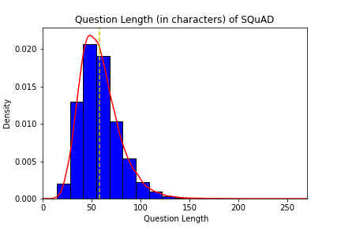

<!-- 

**[Biscuit](http://sblisesivdin.github.io/biscuit)** is a single-page responsive Jekyll theme. This is the most simple and still-good-looking Jekyll theme that you can find.  -->

<h1 style="text-align: center;"><Strong>Reliable Answer Deduction (RAD)</Strong></h1>
<h2 style="text-align: center; margin-top:-2.5rem;">Know When To And When Not To</h2>

<h3 style="text-align: center;">CS7641 | Semester Project | Group 33</h3>

## Introduction

There is a plethora of textual information out there and it has become increasingly difficult to draw insights from the data and find the relevant answers to our questions. Question-answering systems like Machine Reading Comprehension (MRC) systems are effective in retrieving useful information, wherein the model retrieves the answer from given comprehensions instead of the web. A lot of attention has been given to MRC tasks lately. Although existing models achieve reasonably good results, they may still produce unreliable answers when the questions are unanswerable and are computationally heavy. Thus, our aim here is to experiment and present a model which is more reliable.

## Problem Definition

Our aim here is to leverage the power of Machine Learning and Natural Language Processing to create a model that deducts the answer when given a passage and also identifies if a question is unanswerable. We plan to develop an ensemble model which successfully accomplishes the task and gives reliable answers to the questions asked from the comprehension. Our proposed approach will be to innovate different modules in our architecture by taking inspiration from state of the art architectures. 

## Dataset
We are going to use Stanford Question Answering Dataset 2.0 ([SQuAD2.0](https://rajpurkar.github.io/SQuAD-explorer/))  combines the 100,000 questions in SQuAD1.1 with over 50,000 unanswerable questions. It was written adversarially by crowdworkers such that unanswerable questions look similar to answerable ones. To do well on SQuAD2.0, systems should answer questions when possible and also determine when no answer is supported by the paragraph and abstain from answering. 

A sample of raw dataset has been shown below showcasing questions with their actual or plausible answers. The *“is_impossible”* flag is provided to distinguish between answerable and unanswerable questions and the features for the question vary accordingly. 

## Sample Dataset Q&A format

 
## Sample Model Output ([Source](https://rajpurkar.github.io/SQuAD-explorer/explore/v2.0/dev/Normans.html?model=nlnet%20(single%20model)%20(Microsoft%20Research%20Asia)&version=v2.0)):

### Dataset Preprocessing & Exploration

When it comes to SQUAD 2.0 dataset, we found it to be mostly reliable and clean. However, we did do some basic cleaning exercise of removing the additional white spaces, conversion to lower case, stripping of unknown ASCII characters and tokenization as per the model requirement. Datapoints which had unreasonably small question length have been removed from both Training and Testing datasets. In order to convert the words in the passage to their root form to be in sync with the answers, we have used Lemmatization technique. Feature engineering was also done to find the end character of the answers given we have been provided with the start character.

The training dataset of SQUAD 2.0 is unbalanced with two thirds of questions being "Answerable" and the testing dataset is highly balanced with the "Answerable" questions comprising 49.9% of the data as can be seen below.

<!--   -->
 

 

We also did an analysis to understand the distribution of questions per passage across the train and test datasets and concluded that test dataset has an average of 10 questions being asked per context passage and the distributions are shown below:

<!--   -->

 

Next, we looked at the lengths of the context, questions and answers

<!--   -->

## Algorithms/Methods:
We would be using a Deep Learning architecture for our Machine Reading Comprehension (MRC) task. It would involve the following sections/tasks -
Embedding module, Feature extraction, Context question interaction, Verification module and answer prediction. 
We would use contextual embeddings from BERT and then experiment with the feature extraction techniques in combination with the attentive context question interaction methods. Span Extractor has been proven to work well as an answer predictor in MRC tasks in existing literature[7]  but we would be experimenting with other methods as well. We would also be exploring unsupervised models which learn via self-supervision.

## Potential results and Discussion
We hope to achieve competent scores on the popularly used metrics for this task which are F1 score and EM score. These scores are already used in the SQuaD[5] to compare various models on the dataset. Additionally, if we are able to develop a competent model, we would also like to focus on keeping the model light in terms of the model size, so that it could be deployed in places where computational resources are limited.

## Data Exploration

<!--  -->

<!--  -->

## Gantt Chart

## References:

1. [Retrospective Reader for Machine Reading Comprehension](https://arxiv.org/abs/2001.09694) 
2. [NEURQURI: NEURAL QUESTION REQUIREMENT INSPECTOR FOR ANSWERABILITY PREDICTION IN MACHINE READING COMPREHENSION](https://openreview.net/pdf?id=ryxgsCVYPr)
3. [Know What You Don't Know: Unanswerable Questions for SQuAD](https://arxiv.org/abs/1806.03822) 
4. [MobileBERT: a Compact Task-Agnostic BERT for Resource-Limited Devices](https://arxiv.org/pdf/2004.02984)
5. [SQuAD: 100,000+ Questions for Machine Comprehension of Text](https://arxiv.org/pdf/1606.05250.pdf)
6. [Bridging the Gap between Language Model and Reading Comprehension: Unsupervised MRC via Self-Supervision](https://arxiv.org/pdf/2107.08582v1.pdf)
7. [Neural Machine Reading Comprehension: Methods and Trends](https://arxiv.org/abs/1907.01118) 

## Team

* [Harsh Goyal](mailto:hgoyal34@gatech.edu)
* [Kritika Venkatachalam](mailto:kvenkata8@gatech.edu)
* [Nemath Ahmed](mailto:nshaik6@gatech.edu) 
* [Pankhuri Singh](mailto:psingh374@gatech.edu)
* [Siddharth Singh Solanki](mailto:siddharth.solanki@gatech.edu)

<!-- ### Files

* `_config.yml`            : Main configuration file.
* `index.md`               : Website page (for now, this page).
* `_includes/head.html`    : File to add custom code to `<head>` section.
* `_includes/scripts.html` : File to add custom code before `</body>`. You can change footer at here.
* `_sass` folder           : Related scss files can be found at this folder.
* `css/main.csss`          : Main scss file.
* `README.md`              : A simple readme file.

## Example tag usage

## Header 1
### Header 2
#### Header 3
**bold**
*italic*

> blockquotes

~~~python
import os,time
print ("Biscuit")
~~~

## Licence and Author Information

Biscuit is derived from currently deprecated theme [Solo](http://github.com/chibicode/solo). The development of Biscuit is maintained by [Sefer Bora Lisesivdin](https://lrgresearch.org/bora).

Biscuit and the previous code where Biscuit is derived are distributed with [MIT license](https://github.com/sblisesivdin/biscuit/blob/gh-pages/LICENSE).
 -->
